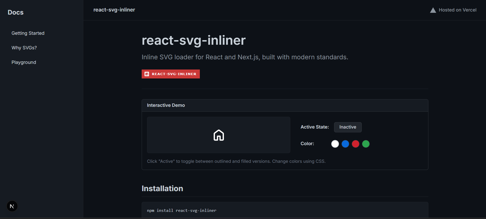
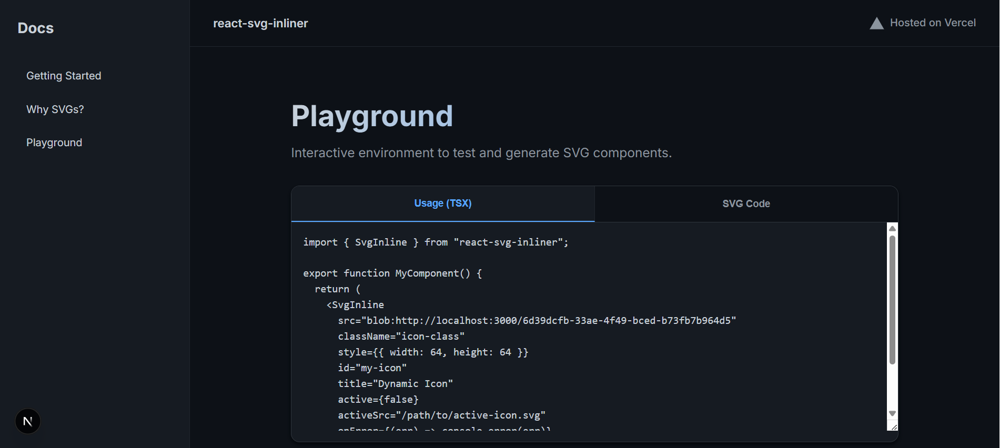
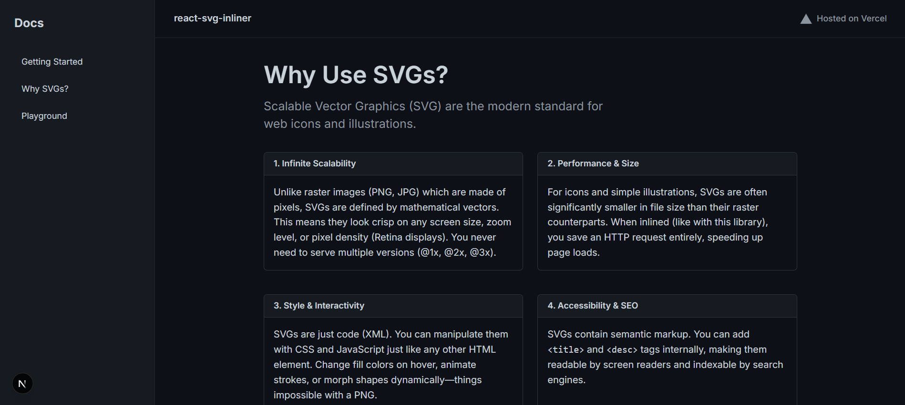

# React SVG Inliner - Documentation Web App

Welcome to the documentation and showcase website for `react-svg-inliner`. This modern web application is built to demonstrate the power, flexibility, and ease of use of the `react-svg-inliner` library.

The site is designed with a focus on performance, aesthetics, and developer experience, providing an interactive playground and in-depth explanations of why SVGs are the superior choice for modern web development.

## ⚡ Tech Stack

This project leverages the latest standards in web development:

*   **Next.js 16 (App Router)**: Utilizing the latest React framework for server-side rendering, static generation, and efficient routing.
*   **React 19**: Built on the cutting-edge version of React.
*   **TypeScript**: Ensuring type safety and a robust development experience.
*   **CSS Modules**: For scoped, maintainable, and collision-free styling.
*   **Modern CSS**: Utilizing CSS variables and native features for a responsive and themable design.

## 🚀 Getting Started

Follow these steps to run the documentation locally on your machine.

### 1. Clone the Repository

If you haven't already, clone the `react-svg-inliner` repository:

```bash
git clone https://github.com/codejovz/react-svg-inliner.git
```

### 2. Navigate to the Project Directory

Switch to the `docs` folder where this web application resides:

```bash
cd react-svg-inliner/docs
```

### 3. Install Dependencies

Install the necessary dependencies using `npm`:

```bash
npm install
```

### 4. Run the Development Server

Start the local development server:

```bash
npm run dev
```

Open [http://localhost:3000](http://localhost:3000) with your browser to see the result.

## 📂 Project Structure

This project follows a **Feature-Based Architecture** using the Next.js App Router. This keeps related code collocated, making it easier to maintain and scale.

```
docs/
├── src/
│   ├── app/                 # App Router: Routes & Pages
│   │   ├── page.tsx         # Landing Page (Home)
│   │   ├── playground/      # Playground Feature
│   │   └── why-svgs/        # "Why SVGs?" Feature
│   ├── components/          # Reusable UI Components
│   └── ...
├── public/                  # Static Assets
└── ...
```

*   **`src/app`**: Contains the main application logic. Each folder represents a route (e.g., `/playground`, `/why-svgs`), encompassing its own page, layout, and specific styles.
*   **`src/components`**: Houses shared, reusable components used across different pages to ensure consistency.

## 📸 Gallery

Here is a preview of the application:

### Landing Page
The entry point featuring a comprehensive guide and introduction.


### Interactive Playground
A dedicated space to test `react-svg-inliner` in real-time. Code on the left, live preview on the right.


### Why SVGs?
An educational page explaining the benefits of scalable vector graphics.
